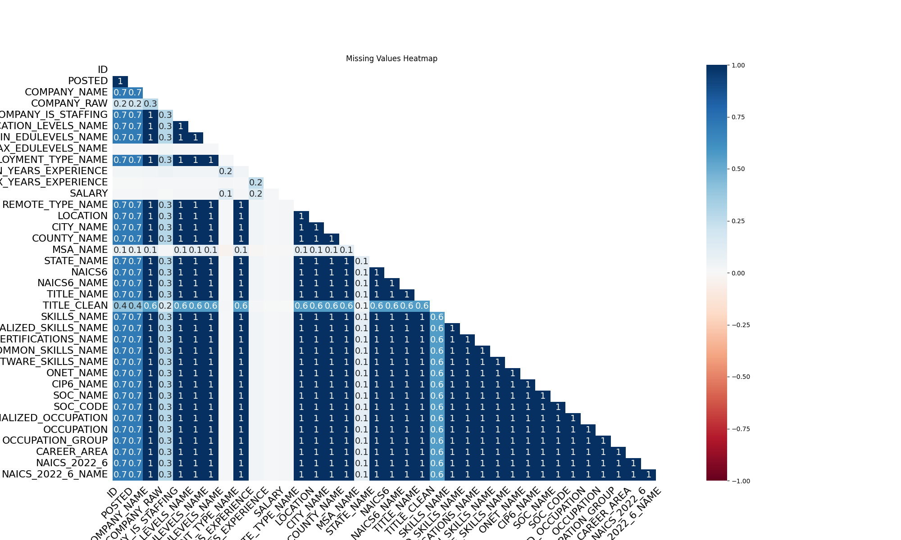

Cleaning the data set is a crucial step to the analysis process. Keeping relevant data only and removing any duplicates or replacing any missing values helps to bring more accuracy and consiceness to the analysis. 

```{python}
#| echo: true
#| eval: true
import pandas as pd
```

```{python}
#| echo: true
#| eval: false
from pyspark.sql import SparkSession

# Start a Spark session
spark = SparkSession.builder.config("spark.driver.host", "localhost").appName("JobPostingsAnalysis").getOrCreate()
spark.catalog.clearCache()

# Load the CSV file into a Spark DataFrame
df = spark.read.option("header", "true").option("inferSchema", "true").option(
    "multiLine", "true").option("escape", "\"").csv("data/lightcast_job_postings.csv")

# Register the DataFrame as a temporary SQL view
df.createOrReplaceTempView("job_postings")

# Show Schema and Sample Data
# print("---This is Diagnostic check, No need to print it in the final doc---")

# comment the lines below when rendering the submission
# df.printSchema()
# df.show(5)
```

## Keeping Necessary Columns

The following columns were chosen as they provide relevant information for analysis. NIACS, ONET, CIP, SOC, and LOT categories all had multiple different columns - only the latest were kept in order to reflect the current classifications. Cutting down the amount of columns and data set overall helps to make a cleaner data set to work with with less clutter.
```{python}
#| echo: true
#| eval: false
from pyspark.sql.functions import col, monotonically_increasing_id

clean_df = df.select(
    col("POSTED"),
    col("COMPANY_IS_STAFFING"),
    col("EDUCATION_LEVELS_NAME"),
    col("MIN_EDULEVELS_NAME"),
    col("MAX_EDULEVELS_NAME"),
    col("EMPLOYMENT_TYPE_NAME"),
    col("MIN_YEARS_EXPERIENCE"), 
    col("MAX_YEARS_EXPERIENCE"), 
    col("SALARY"),
    col("SALARY_TO"),
    col("SALARY_FROM"),
    col("REMOTE_TYPE_NAME"), 
    col("LOCATION"),
    col("CITY_NAME"),
    col("MSA_NAME"),
    col("STATE_NAME"),
    col("NAICS6"),
    col("NAICS6_NAME"),
    col("SKILLS_NAME"),
    col("SPECIALIZED_SKILLS_NAME"),
    col("CERTIFICATIONS_NAME"),
    col("COMMON_SKILLS_NAME"),
    col("SOFTWARE_SKILLS_NAME"),
    # col("ONET_NAME"),
    col("CIP6_NAME"),
    # col("SOC_5_NAME").alias("SOC_NAME"),
    # col("SOC_5").alias("SOC_CODE"),
    col("LOT_V6_SPECIALIZED_OCCUPATION_NAME").alias("SPECIALIZED_OCCUPATION"),
    col("LOT_V6_OCCUPATION_NAME").alias("OCCUPATION"),
    col("LOT_V6_OCCUPATION_GROUP_NAME").alias("OCCUPATION_GROUP"),
    col("LOT_V6_CAREER_AREA_NAME").alias("CAREER_AREA"),
)

```


## Handling Missing Values
### Numerical Fields - Filled with Median
```{python}
#| echo: true
#| eval: false
import os
from pyspark.sql. functions import regexp_replace

clean_df = clean_df.withColumn ("SALARY_FROM",col("SALARY_FROM").cast("float")) \
    .withColumn("SALARY_TO", col("SALARY_TO").cast("float")) \
    .withColumn("SALARY", col("SALARY").cast("float")) \
    .withColumn("MAX_YEARS_EXPERIENCE", col("MAX_YEARS_EXPERIENCE").cast("float"))

def compute_median (sdf, col_name):
    q = sdf.approxQuantile(col_name, [0.5], 0.01)
    return q[0] if q else None

median_from = compute_median(clean_df, "SALARY_FROM")
median_to = compute_median(clean_df, "SALARY_TO")
median_salary = compute_median(clean_df, "SALARY")

print("Medians:", median_from, median_to, median_salary)

clean_df = clean_df.fillna({
    "SALARY_FROM": median_from,
    "SALARY_TO": median_to
})

clean_df = clean_df.withColumn("AVERAGE_SALARY", (col("SALARY_FROM") + col("SALARY_TO")) / 2)

clean_df = clean_df.withColumn(
    "EDUCATION_LEVELS_NAME",
    regexp_replace(col("EDUCATION_LEVELS_NAME"), r"[\n\r]","")
)

# clean_df.show(10)
clean_pd = clean_df.toPandas()
clean_pd.head()
```

### Columns with >50% Missing - Dropped

```{python}
#| echo: true
#| eval: false
import matplotlib.pyplot as plt
import missingno as msno

msno.heatmap(clean_pd)
plt.title("Missing Values Heatmap")
plt.savefig("./images/missing_values_heatmap.png")
plt.show()


```

{width="80%" fig-align="center" #fig-heatmap}

### Categorical Fields - Filled with "Unknown"
```{python}
#| echo: true
#| eval: false

categorical_cols = clean_pd.select_dtypes(include=["object", "category", "string"]).columns.tolist()
numerical_cols = clean_pd.select_dtypes(include=["number"]).columns.tolist()

print("Categorical:", categorical_cols)
print("Numerical:", numerical_cols)
```

## Missing Value Imputation - Categorical Columns and Numerical Columns

```{python}
#| echo: true
#| eval: false
cols = ['COMPANY_IS_STAFFING', 'EDUCATION_LEVELS_NAME', 'MIN_EDULEVELS_NAME', 'EMPLOYMENT_TYPE_NAME', 'MIN_YEARS_EXPERIENCE','REMOTE_TYPE_NAME','NAICS6','NAICS6_NAME', 'SKILLS_NAME', 'SPECIALIZED_SKILLS_NAME', 'CERTIFICATIONS_NAME', 'COMMON_SKILLS_NAME', 'SOFTWARE_SKILLS_NAME', 'ONET_NAME', 'CIP6_NAME', 'SOC_NAME', 'SOC_CODE', 'SPECIALIZED_OCCUPATION', 'OCCUPATION', 'OCCUPATION_GROUP', 'CAREER_AREA', 'LOCATION', 'POSTED']

clean_pd[cols] = clean_pd[cols].fillna("Unknown")

clean_pd.isnull().sum()
clean_pd.head(10)
```

## Remove Duplicates
This step helps to ensure that there is no duplication in the data set and only each job posting is counted once. 
```{python}
#| echo: true
#| eval: false
# clean_pd = clean_pd.drop_duplicates(subset=["TITLE_NAME", "COMPANY_NAME", "LOCATION", "POSTED"], keep="first")
```

## Save as CSV
```{python}
#| echo: true
#| eval: false
clean_pd.to_csv("./data/clean_job_postings.csv", index=False)
schema_str = clean_df._jdf.schema().treeString()

with open("./data/schema_output.txt", "w") as f:
    f.write(schema_str)

```

```{python}
#| echo: false
#| eval: true

with open("./data/schema_output.txt", "r") as f:
    schema_str = f.read()

print(schema_str)
```