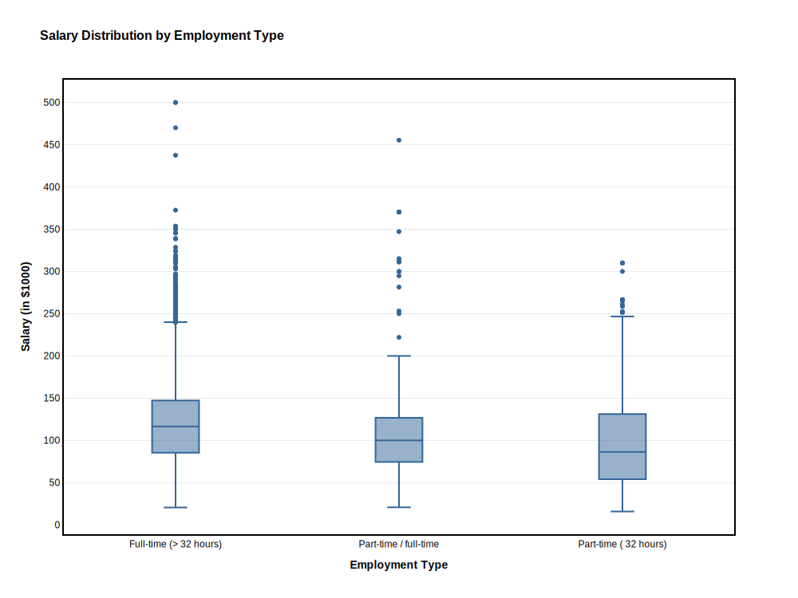

Exploratory Data Analysis (EDA) is a crucial step in the data analysis process that involves summarizing the main characteristics of a dataset, often using visual methods. The goal of EDA is to gain insights into the data, identify patterns, detect anomalies, and test hypotheses before applying more formal statistical modeling techniques.

```{python}
#| echo: true
#| eval: false

from pyspark.sql import SparkSession

# Start a Spark session
spark = SparkSession.builder.config("spark.driver.host", "localhost").appName("JobPostingsAnalysis").getOrCreate()
spark.catalog.clearCache()

# Load the CSV file into a Spark DataFrame
df = spark.read.option("header", "true").option("inferSchema", "true").option(
    "multiLine", "true").option("escape", "\"").csv("./data/clean_job_postings.csv")

# Register the DataFrame as a temporary SQL view
df.createOrReplaceTempView("clean_job_postings")

# Show Schema and Sample Data
# print("---This is Diagnostic check, No need to print it in the final doc---")

# comment the lines below when rendering the submission
# df.printSchema()
# df.show(5)
```

```{python}
#| echo: true
#| eval: true
with open("./data/schema_output.txt", "r") as f:
    schema_str = f.read()

print(schema_str)
```

# Salary Type by Employment Type - Show how salary types (e.g., hourly, yearly) vary across different employment types (e.g., full-time, part-time).

```{python}
#| echo: true
#| eval: false
#| label: salary_employment_type

import pandas as pd
import polars as pl 
import plotly.express as px
import plotly.io as pio
import re
import numpy as np
import plotly.graph_objects as go
# Filter out missing or zero salary values
pdf = df.filter(df["SALARY"] > 0).select("EMPLOYMENT_TYPE_NAME", "SALARY").toPandas()
pdf["EMPLOYMENT_TYPE_NAME"] = pdf["EMPLOYMENT_TYPE_NAME"].apply(lambda x: re.sub(r"[^\x00-\x7F]+", "", x)) # [0-9]{5}
median_salaries = pdf.groupby("EMPLOYMENT_TYPE_NAME")["SALARY"].median()

# Sort employment types based on median salary in descending order
sorted_employment_types = median_salaries.sort_values(ascending=False).index

# Apply sorted categories
pdf["EMPLOYMENT_TYPE_NAME"] = pd.Categorical(
    pdf["EMPLOYMENT_TYPE_NAME"], 
    categories=sorted_employment_types, 
    ordered=True
)

# Create box plot with horizontal grid lines
fig = px.box(
    pdf, 
    x="EMPLOYMENT_TYPE_NAME", 
    y="SALARY", 
    title="Salary Distribution by Employment Type", 
    color_discrete_sequence=["#336699"],  # Single neutral color
    boxmode="group",
    points="outliers",  # Show all outliers
)

# Improve layout, font styles, and axis labels
fig.update_layout(
    title=dict(
        text="Salary Distribution by Employment Type", 
        font=dict(size=16, family="Helvetica", color="black", weight="bold")  # Bigger & Bold Title
    ),
    xaxis=dict(
        title=dict(text="Employment Type", font=dict(size=14, family="Helvetica", color="black", weight="bold")),  # Bigger X-label
        tickangle=0,  # Rotate X-axis labels for readability
        tickfont=dict(size=12, family="Helvetica", color="black"),  # Bigger & Bold X-ticks
        showline=True,  # Show axis lines
        linewidth=2,  # Thicker axis lines
        linecolor="black",
        mirror=True,
        showgrid=False,  # Remove vertical grid lines
        categoryorder="array",  
        categoryarray=sorted_employment_types.tolist()
    ),
    yaxis=dict(
        title=dict(text="Salary (in $1000)", font=dict(size=14, family="Helvetica", color="black", weight="bold")),  # Bigger Y-label
        tickvals=[0, 50000, 100000, 150000, 200000, 250000, 300000, 350000, 400000, 450000, 500000],
        ticktext=["0", "50", "100", "150", "200", "250", "300", "350", "400", "450", "500"],
        tickfont=dict(size=12, family="Helvetica", color="black"),  # Bigger & Bold Y-ticks
        showline=True,
        linewidth=2,
        linecolor="black",
        mirror=True,  
        showgrid=True,  # Enable light horizontal grid lines
        gridcolor="lightgray",  # Light shade for the horizontal grid
        gridwidth=0.5  # Thin grid lines
    ),
    font=dict(family="Helvetica", size=12, color="black"),
    boxgap=0.7,  
    plot_bgcolor="white",
    paper_bgcolor="white",
    showlegend=False,  
    height=750,  
    width=1000,  
)

# Kaleido package not working
# source .venv/bin/activate
# pip install kaleido
# Show the figure
fig.show()
fig.write_html("images/salary_employment_type.html")
fig.write_image("images/salary_employment_type.svg", width=1000, height=750, scale=1)
fig.write_image("images/salary_employment_type.png", width=1200, height=800, scale=1)

```

{width="80%" fig-align="center" #fig-salary-employment-type}

# Count of Specialized Occupation - to show which roles dominate the market.

```{python}
#| echo: true
#| eval: true

```

# Skill demand analysis - Explode SOFTWARE_SKILLS_NAME, SPECIALIZED_SKILLS_NAME, and COMMON_SKILLS_NAME, then count frequency of each skill across all postings.
```{python}
#| echo: true
#| eval: true

```

# Skill-by-role analysis - Compare top skills within each major role group. 
```{python}
#| echo: true
#| eval: true

```

# Time trend analysis - Use POSTED by month. This shows whether demand is stable, rising, or seasonal.
```{python}
#| echo: true
#| eval: true

```

# Geography analysis - Use STATE_NAME, CITY_NAME, or MSA_NAME to show where demand is concentrated. 
```{python}
#| echo: true
#| eval: true

```

# Remote-work analysis - Compare REMOTE_TYPE_NAME by role and skill.
```{python}
#| echo: true
#| eval: true

```

# Salary vs demand analysis - Use sVERAGE_SALARY, compare demand with pay by role or skill cluster.
```{python}
#| echo: true
#| eval: true

```