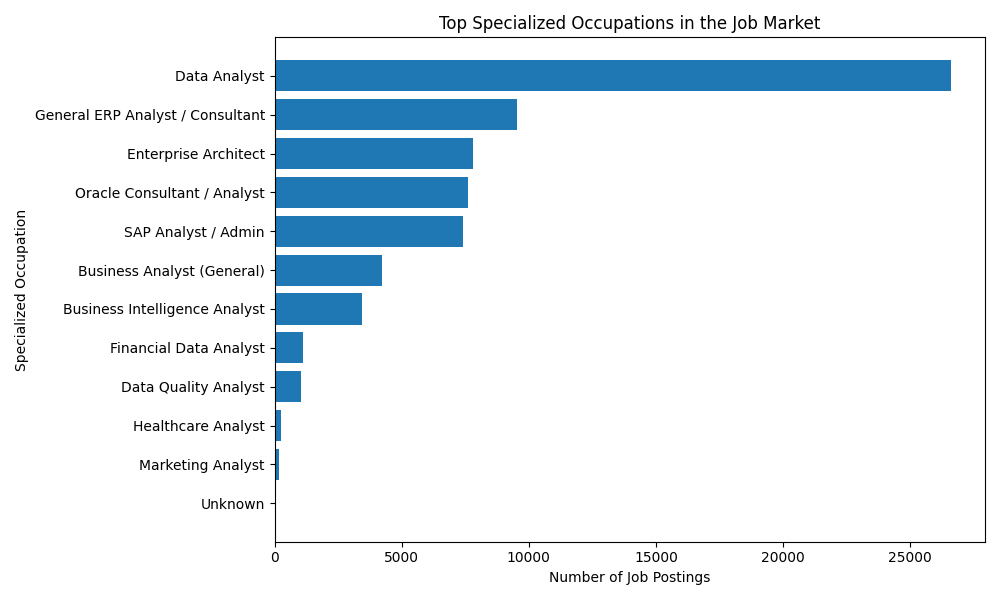
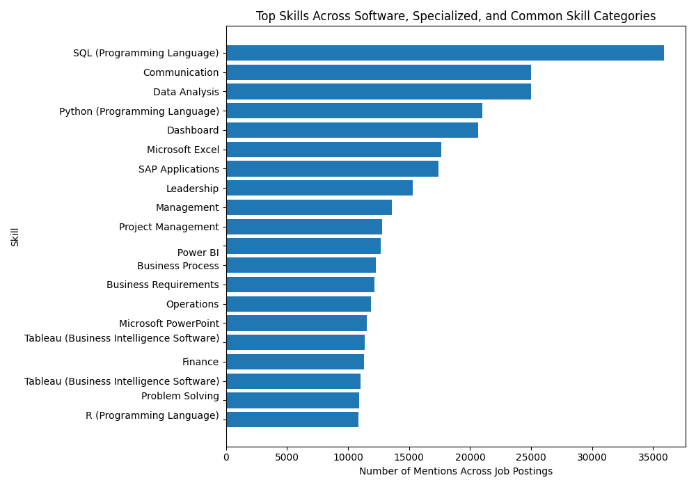
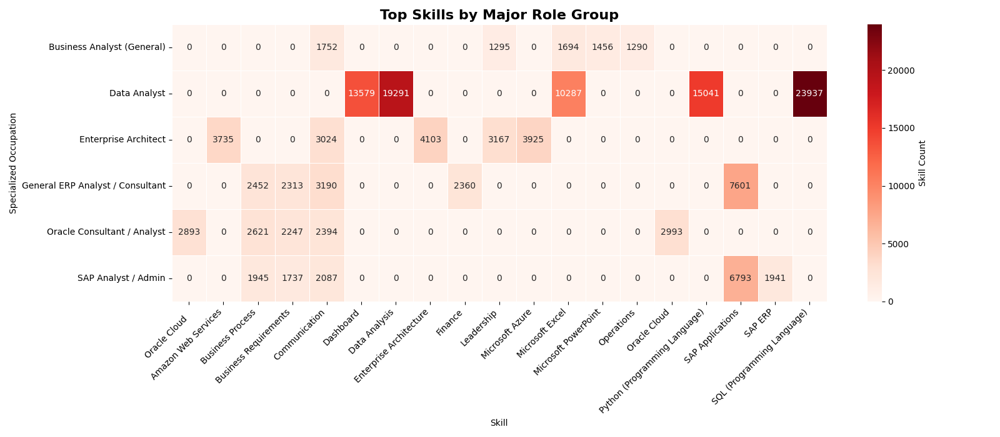
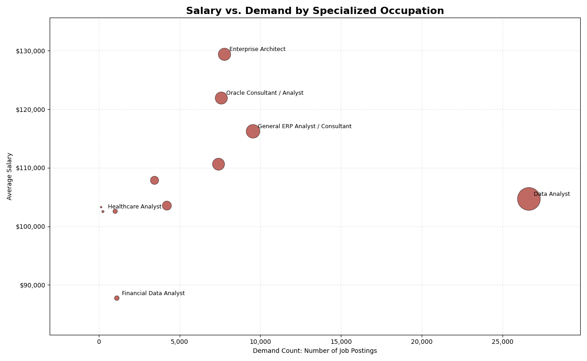
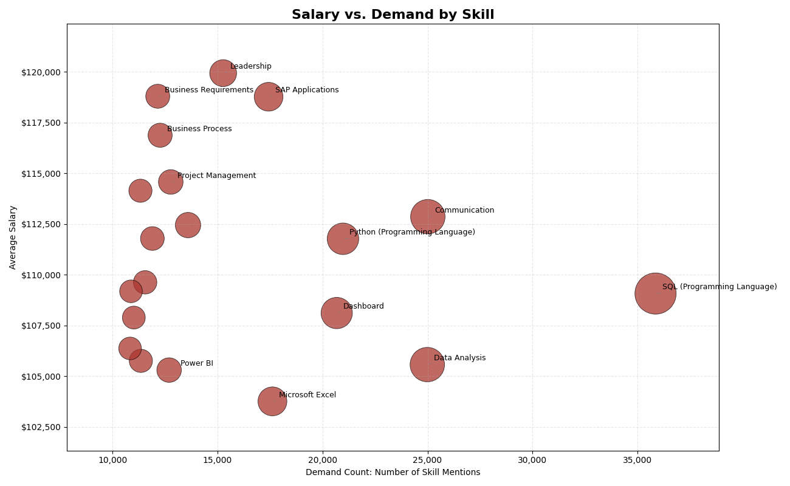

Exploratory Data Analysis (EDA) is a crucial step in the data analysis process that involves summarizing the main characteristics of a dataset, often using visual methods. The goal of EDA is to gain insights into the data, identify patterns, detect anomalies, and test hypotheses before applying more formal statistical modeling techniques.

```{python}
#| echo: true
#| eval: false
from pyspark.sql import SparkSession

# Start a Spark session
spark = SparkSession.builder.config("spark.driver.host", "localhost").appName("JobPostingsAnalysis").getOrCreate()
spark.catalog.clearCache()

# Load the CSV file into a Spark DataFrame
df = spark.read.option("header", "true").option("inferSchema", "true").option(
    "multiLine", "true").option("escape", "\"").csv("./data/clean_job_postings.csv")

# Register the DataFrame as a temporary SQL view
df.createOrReplaceTempView("clean_job_postings")

# Show Schema and Sample Data
print("---This is Diagnostic check, No need to print it in the final doc---")

# comment the lines below when rendering the submission
df.printSchema()
df.show(5)
```

```{python}
#| echo: true
#| eval: false
with open("./data/schema_output.txt", "r") as f:
    schema_str = f.read()

print(schema_str)
```

# Count of Specialized Occupation
## Table
```{python}
#| echo: true
#| eval: false
import matplotlib.pyplot as plt

specialized_occupation_counts = (
    df
    .filter(df["SPECIALIZED_OCCUPATION"].isNotNull())
    .groupBy("SPECIALIZED_OCCUPATION")
    .count()
    .orderBy("count", ascending=False)
)

top_specialized_occupations = (
    specialized_occupation_counts
    .limit(15)
    .toPandas()
)

top_specialized_occupations.columns = [
    "Specialized Occupation",
    "Count"
]

top_specialized_occupations
```
## Visualization
```{python}
#| echo: true
#| eval: false
plt.figure(figsize=(10, 6))

plt.barh(
    top_specialized_occupations["Specialized Occupation"],
    top_specialized_occupations["Count"]
)

plt.xlabel("Number of Job Postings")
plt.ylabel("Specialized Occupation")
plt.title("Top Specialized Occupations in the Job Market")

plt.gca().invert_yaxis()
plt.tight_layout()
plt.savefig("./images/top_specialized_occupations.png")
plt.show()
```
{width="80%" fig-align="center" #fig-heatmap}

# Skill Demand Analysis
## Table
```{python}
#| echo: true
#| eval: false
from pyspark.sql import functions as F
import matplotlib.pyplot as plt

skill_columns = [
    "SOFTWARE_SKILLS_NAME",
    "SPECIALIZED_SKILLS_NAME",
    "COMMON_SKILLS_NAME"
]

skill_dfs = []

for col_name in skill_columns:
    temp_df = (
        df
        .select(
            F.lit(col_name).alias("skill_type"),
            F.explode(
                F.split(
                    F.regexp_replace(F.col(col_name), r'[\[\]"]', ''),
                    r',\s*'
                )
            ).alias("skill")
        )
        .withColumn("skill", F.trim(F.col("skill")))
        .filter(F.col("skill").isNotNull())
        .filter(F.col("skill") != "")
        .filter(F.col("skill") != "None")
    )

    skill_dfs.append(temp_df)

all_skills = skill_dfs[0]

for temp_df in skill_dfs[1:]:
    all_skills = all_skills.unionByName(temp_df)

skill_frequency = (
    all_skills
    .groupBy("skill")
    .count()
    .orderBy("count", ascending=False)
)
top_skills = skill_frequency.limit(20).toPandas()

top_skills
```
## Visualization
```{python}
#| echo: true
#| eval: false
plt.figure(figsize=(10, 7))

plt.barh(
    top_skills["skill"],
    top_skills["count"]
)

plt.xlabel("Number of Mentions Across Job Postings")
plt.ylabel("Skill")
plt.title("Top Skills Across Software, Specialized, and Common Skill Categories")

plt.gca().invert_yaxis()
plt.tight_layout()
plt.savefig("./images/top_skills.png")
plt.show()
```
{width="80%" fig-align="center" #fig-heatmap}
# Skill-by-Role Analysis
```{python}
#| echo: true
#| eval: false
from pyspark.sql import functions as F
import matplotlib.pyplot as plt
from pyspark.sql.window import Window

# Skill columns to analyze
skill_columns = [
    "SOFTWARE_SKILLS_NAME",
    "SPECIALIZED_SKILLS_NAME",
    "COMMON_SKILLS_NAME"
]

# Choose major role groups by demand
top_roles = (
    df
    .filter(F.col("SPECIALIZED_OCCUPATION").isNotNull())
    .groupBy("SPECIALIZED_OCCUPATION")
    .count()
    .orderBy(F.col("count").desc())
    .limit(6)
)

top_role_names = [
    row["SPECIALIZED_OCCUPATION"]
    for row in top_roles.collect()
]

skill_dfs = []

for skill_col in skill_columns:
    temp_df = (
        df
        .filter(F.col("SPECIALIZED_OCCUPATION").isin(top_role_names))
        .select(
            F.col("SPECIALIZED_OCCUPATION"),
            F.lit(skill_col).alias("Skill_Type"),
            F.explode(
                F.split(
                    F.regexp_replace(F.col(skill_col), r'[\[\]"]', ''),
                    r',\s*'
                )
            ).alias("Skill")
        )
        .withColumn("Skill", F.trim(F.col("Skill")))
        .filter(F.col("Skill").isNotNull())
        .filter(F.col("Skill") != "")
        .filter(F.col("Skill") != "None")
    )

    skill_dfs.append(temp_df)

role_skills = skill_dfs[0]

for temp_df in skill_dfs[1:]:
    role_skills = role_skills.unionByName(temp_df)

role_skill_counts = (
    role_skills
    .groupBy("SPECIALIZED_OCCUPATION", "Skill")
    .count()
    .orderBy("SPECIALIZED_OCCUPATION", F.col("count").desc())
)

role_window = Window.partitionBy("SPECIALIZED_OCCUPATION").orderBy(F.col("count").desc())

top_skills_by_role = (
    role_skill_counts
    .withColumn("rank", F.row_number().over(role_window))
    .filter(F.col("rank") <= 5)
    .orderBy("SPECIALIZED_OCCUPATION", "rank")
)

top_skills_by_role_pd = top_skills_by_role.toPandas()

top_skills_by_role_pd
```
## Visualization
```{python}
#| echo: true
#| eval: false
import matplotlib.pyplot as plt
import seaborn as sns

# Create pivot table for heatmap
heatmap_data = top_skills_by_role_pd.pivot_table(
    index="SPECIALIZED_OCCUPATION",
    columns="Skill",
    values="count",
    fill_value=0
)

plt.figure(figsize=(16, 7))

sns.heatmap(
    heatmap_data,
    cmap="Reds",
    linewidths=0.5,
    linecolor="white",
    annot=True,
    fmt=".0f",
    cbar_kws={"label": "Skill Count"}
)

plt.title("Top Skills by Major Role Group", fontsize=16, fontweight="bold")
plt.xlabel("Skill")
plt.ylabel("Specialized Occupation")

plt.xticks(rotation=45, ha="right")
plt.yticks(rotation=0)

plt.tight_layout()
plt.savefig("./images/top_skills_by_role.png")
plt.show()
```
{width="80%" fig-align="center" #fig-heatmap}
# Salary vs Demand by Specialized Occupation Analysis
## Table
```{python}
#| echo: true
#| eval: false
from pyspark.sql import functions as F

salary_demand_by_role = (
    df
    .filter(F.col("SPECIALIZED_OCCUPATION").isNotNull())
    .filter(F.col("AVERAGE_SALARY").isNotNull())
    .groupBy("SPECIALIZED_OCCUPATION")
    .agg(
        F.count("*").alias("Demand_Count"),
        F.avg("AVERAGE_SALARY").alias("Average_Salary")
    )
    .filter(F.col("Demand_Count") >= 50)
    .orderBy(F.col("Demand_Count").desc())
)

salary_demand_roles_pd = salary_demand_by_role.toPandas()

salary_demand_roles_pd.head(15)
```
## Visualization
```{python}
#| echo: true
#| eval: false
import matplotlib.pyplot as plt
import matplotlib.ticker as mtick

plot_df = salary_demand_roles_pd.sort_values(
    "Demand_Count",
    ascending=False
).head(15)

plt.figure(figsize=(13, 8))
ax = plt.gca()

ax.scatter(
    plot_df["Demand_Count"],
    plot_df["Average_Salary"],
    s=plot_df["Demand_Count"] / 20,
    alpha=0.75,
    color="#ab362e",
    edgecolor="black",
    linewidth=0.6
)

label_df = plot_df[
    (plot_df["Demand_Count"] >= plot_df["Demand_Count"].quantile(0.65)) |
    (plot_df["Average_Salary"] >= plot_df["Average_Salary"].quantile(0.75)) |
    (plot_df["Average_Salary"] <= plot_df["Average_Salary"].quantile(0.10))
]

for _, row in label_df.iterrows():
    ax.annotate(
        row["SPECIALIZED_OCCUPATION"],
        xy=(row["Demand_Count"], row["Average_Salary"]),
        xytext=(8, 5),
        textcoords="offset points",
        fontsize=9,
        arrowprops=dict(
            arrowstyle="-",
            color="gray",
            lw=0.5
        )
    )

ax.set_title("Salary vs. Demand by Specialized Occupation", fontsize=16, fontweight="bold")
ax.set_xlabel("Demand Count: Number of Job Postings")
ax.set_ylabel("Average Salary")

ax.xaxis.set_major_formatter(mtick.StrMethodFormatter("{x:,.0f}"))
ax.yaxis.set_major_formatter(mtick.StrMethodFormatter("${x:,.0f}"))

ax.grid(True, linestyle="--", alpha=0.3)
plt.margins(x=0.12, y=0.15)

plt.tight_layout()
plt.savefig("./images/salary_demand_by_role.png")
plt.show()
```
{width="80%" fig-align="center" #fig-heatmap}
# Salary vs Demand by Top Skills Analysis
## Table
```{python}
#| echo: true
#| eval: false
from pyspark.sql import functions as F

skill_columns = [
    "SOFTWARE_SKILLS_NAME",
    "SPECIALIZED_SKILLS_NAME",
    "COMMON_SKILLS_NAME"
]

skill_dfs = []

for skill_col in skill_columns:
    temp_df = (
        df
        .filter(F.col("AVERAGE_SALARY").isNotNull())
        .select(
            F.col("AVERAGE_SALARY"),
            F.explode(
                F.split(
                    F.regexp_replace(F.col(skill_col), r'[\[\]"]', ''),
                    r',\s*'
                )
            ).alias("Skill")
        )
        .withColumn("Skill", F.trim(F.col("Skill")))
        .filter(F.col("Skill").isNotNull())
        .filter(F.col("Skill") != "")
        .filter(F.col("Skill") != "None")
        .filter(F.col("Skill") != "null")
    )

    skill_dfs.append(temp_df)

all_skills_salary = skill_dfs[0]

for temp_df in skill_dfs[1:]:
    all_skills_salary = all_skills_salary.unionByName(temp_df)

salary_demand_by_skill = (
    all_skills_salary
    .groupBy("Skill")
    .agg(
        F.count("*").alias("Demand_Count"),
        F.avg("AVERAGE_SALARY").alias("Average_Salary")
    )
    .filter(F.col("Demand_Count") >= 100)
    .orderBy(F.col("Demand_Count").desc())
)

salary_demand_skills_pd = salary_demand_by_skill.toPandas()

salary_demand_skills_pd.head(20)
```
## Visualization
```{python}
#| echo: true
#| eval: false
import matplotlib.pyplot as plt
import matplotlib.ticker as mtick

plot_df = salary_demand_skills_pd.sort_values(
    "Demand_Count",
    ascending=False
).head(20)

plt.figure(figsize=(13, 8))
ax = plt.gca()

ax.scatter(
    plot_df["Demand_Count"],
    plot_df["Average_Salary"],
    s=plot_df["Demand_Count"] / 15,
    alpha=0.75,
    color="#ab362e",
    edgecolor="black",
    linewidth=0.6
)

# Label important skills only
label_df = plot_df[
    (plot_df["Demand_Count"] >= plot_df["Demand_Count"].quantile(0.65)) |
    (plot_df["Average_Salary"] >= plot_df["Average_Salary"].quantile(0.75)) |
    (plot_df["Average_Salary"] <= plot_df["Average_Salary"].quantile(0.10))
]

for _, row in label_df.iterrows():
    ax.annotate(
        row["Skill"],
        xy=(row["Demand_Count"], row["Average_Salary"]),
        xytext=(8, 5),
        textcoords="offset points",
        fontsize=9,
        arrowprops=dict(
            arrowstyle="-",
            color="gray",
            lw=0.5
        )
    )

ax.set_title("Salary vs. Demand by Skill", fontsize=16, fontweight="bold")
ax.set_xlabel("Demand Count: Number of Skill Mentions")
ax.set_ylabel("Average Salary")

ax.xaxis.set_major_formatter(mtick.StrMethodFormatter("{x:,.0f}"))
ax.yaxis.set_major_formatter(mtick.StrMethodFormatter("${x:,.0f}"))

ax.grid(True, linestyle="--", alpha=0.3)
plt.margins(x=0.12, y=0.15)

plt.tight_layout()
plt.savefig("./images/salary_demand_by_skill.png")
plt.show()
```
{width="80%" fig-align="center" #fig-heatmap}