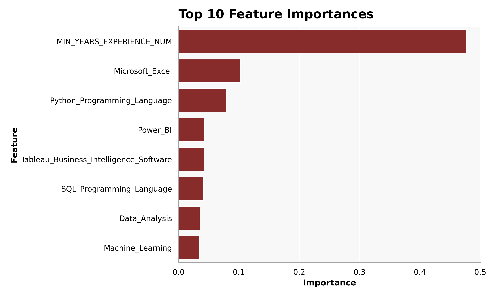

Using machine learning methods to predict job growth trends.
```{python}
#| echo: false
#| warning: false
#| message: false

import plotly_setup
import matplotlib_setup
```
```{python}
#| echo: true
#| eval: false
#| warning: false
#| message: false
from pyspark.sql import SparkSession

# Start a Spark session
spark = SparkSession.builder.config("spark.driver.host", "localhost").appName("JobPostingsAnalysis").getOrCreate()
spark.catalog.clearCache()

# Load the CSV file into a Spark DataFrame
df = spark.read.option("header", "true").option("inferSchema", "true").option(
    "multiLine", "true").option("escape", "\"").csv("./data/clean_job_postings.csv")

# Register the DataFrame as a temporary SQL view
df.createOrReplaceTempView("clean_job_postings")

# Show Schema and Sample Data
#print("---This is Diagnostic check, No need to print it in the final doc---")

# comment the lines below when rendering the submission
#df.printSchema()
#df.show(5)
```
# Filtering and Feature Selection
```{python}
#| echo: true
#| eval: false
#| warning: false
#| message: false
from pyspark.sql import functions as F

topic_keywords = [
    "data scientist",
    "data analyst",
    "business analyst",
    "business intelligence",
    "machine learning",
    "analytics"
]

condition = None
for kw in topic_keywords:
    current_condition = F.lower(F.col("SPECIALIZED_OCCUPATION")).contains(kw)
    condition = current_condition if condition is None else (condition | current_condition)

df_analysis = df.filter(F.col("SALARY").isNotNull()) \
    .filter(F.col("SPECIALIZED_OCCUPATION").isNotNull()) \
    .filter(condition)

df_analysis.select("SPECIALIZED_OCCUPATION", "SALARY").show(10, truncate=False)
print("Filtered row count:", df_analysis.count())
```
# Feature Engineering
```{python}
#| echo: true
#| eval: false
#| warning: false
#| message: false
skill_features = [
    "Python (Programming Language)",
    "SQL (Programming Language)",
    "Microsoft Excel",
    "Data Analysis",
    "Machine Learning",
    "Power BI",
    "Tableau (Business Intelligence Software)"
]

df_analysis = df_analysis.withColumn(
    "ALL_SKILLS_TEXT",
    F.concat_ws(
        " ",
        F.coalesce(F.col("SOFTWARE_SKILLS_NAME"), F.lit("")),
        F.coalesce(F.col("SPECIALIZED_SKILLS_NAME"), F.lit("")),
        F.coalesce(F.col("COMMON_SKILLS_NAME"), F.lit(""))
    )
)

for skill in skill_features:
    safe_name = skill.replace(" ", "_") \
                     .replace("(", "") \
                     .replace(")", "") \
                     .replace("/", "_") \
                     .replace("-", "_")
    
    df_analysis = df_analysis.withColumn(
        safe_name,
        F.when(F.col("ALL_SKILLS_TEXT").contains(skill), 1).otherwise(0)
    )

df_analysis.select(
    "SALARY",
    "Python_Programming_Language",
    "SQL_Programming_Language",
    "Microsoft_Excel",
    "Data_Analysis",
    "Machine_Learning",
    "Power_BI",
    "Tableau_Business_Intelligence_Software"
).show(5, truncate=False)
```

```{python}
#| echo: true
#| eval: false
#| warning: false
#| message: false

df_analysis = df_analysis.withColumn(
    "MIN_YEARS_EXPERIENCE_NUM",
    F.when(
        F.col("MIN_YEARS_EXPERIENCE").rlike("^[0-9]+(\\.[0-9]+)?$"),
        F.col("MIN_YEARS_EXPERIENCE").cast("double")
    ).otherwise(0.0)
)

df_analysis = df_analysis.fillna({
    "REMOTE_TYPE_NAME": "Not Listed",
    "MIN_EDULEVELS_NAME": "Not Listed"
})

df_analysis.select(
    "MIN_YEARS_EXPERIENCE",
    "MIN_YEARS_EXPERIENCE_NUM",
    "REMOTE_TYPE_NAME",
    "MIN_EDULEVELS_NAME"
).show(10, truncate=False)
```
# Variable Selection
```{python}
#| echo: true
#| eval: false
#| warning: false
#| message: false
continuous_cols = [
    "MIN_YEARS_EXPERIENCE_NUM",
    "Python_Programming_Language",
    "SQL_Programming_Language",
    "Microsoft_Excel",
    "Data_Analysis",
    "Machine_Learning",
    "Power_BI",
    "Tableau_Business_Intelligence_Software"
]

categorical_cols = [
    "REMOTE_TYPE_NAME",
    "SPECIALIZED_OCCUPATION"
]

target_col = "SALARY"

df_final = df_analysis.select(continuous_cols + categorical_cols + [target_col])

df_final = df_final.dropna(subset=continuous_cols + categorical_cols + [target_col])

df_final.show(5, truncate=False)
```

# String Indexing and One-Hot Encoding
```{python}
#| echo: true
#| eval: false
#| warning: false
#| message: false
from pyspark.ml.feature import StringIndexer, OneHotEncoder, VectorAssembler
from pyspark.ml import Pipeline

indexers = [
    StringIndexer(inputCol=col, outputCol=f"{col}_idx", handleInvalid="skip")
    for col in categorical_cols
]

encoders = [
    OneHotEncoder(inputCol=f"{col}_idx", outputCol=f"{col}_vec", dropLast=True)
    for col in categorical_cols
]

assembler = VectorAssembler(
    inputCols=continuous_cols + [f"{col}_vec" for col in categorical_cols],
    outputCol="features"
)

pipeline = Pipeline(stages=indexers + encoders + [assembler])
data = pipeline.fit(df_final).transform(df_final)

ml_ready = data.select("SALARY", "features")
ml_ready.show(5, truncate=False)
```
# Train-Test Split
```{python}
#| echo: true
#| eval: false
#| warning: false
#| message: false

train_df, test_df = ml_ready.randomSplit([0.8, 0.2], seed=42)

print(f"Dimensions of full data: ({ml_ready.count()}, {len(ml_ready.columns)})")
print(f"Dimensions of training data: ({train_df.count()}, {len(train_df.columns)})")
print(f"Dimensions of test data: ({test_df.count()}, {len(test_df.columns)})")
```
# Models
## Linear Regression Model
```{python}
#| echo: true
#| eval: false
#| warning: false
#| message: false
from pyspark.ml.regression import LinearRegression
from pyspark.ml.evaluation import RegressionEvaluator

lr = LinearRegression(
    featuresCol="features",
    labelCol="SALARY",
    predictionCol="prediction",
    solver="normal",
    regParam=0.0,
    elasticNetParam=0.0
)

lr_model = lr.fit(train_df)

predictions = lr_model.transform(test_df)

predictions.select("SALARY", "prediction").show(10, truncate=False)
```
```{python}
#| echo: true
#| eval: false
#| warning: false
#| message: false
r2 = RegressionEvaluator(
    labelCol="SALARY",
    predictionCol="prediction",
    metricName="r2"
).evaluate(predictions)

rmse = RegressionEvaluator(
    labelCol="SALARY",
    predictionCol="prediction",
    metricName="rmse"
).evaluate(predictions)

mae = RegressionEvaluator(
    labelCol="SALARY",
    predictionCol="prediction",
    metricName="mae"
).evaluate(predictions)

print("Intercept:", lr_model.intercept)
print("Coefficients:", lr_model.coefficients)
print("R-squared:", r2)
print("RMSE:", rmse)
print("MAE:", mae)
```
```{python}
#| echo: true
#| eval: false
#| warning: false
#| message: false
num_features = lr_model.coefficients.size

feature_names = continuous_cols.copy()

remaining_features = num_features - len(feature_names)

for i in range(remaining_features):
    feature_names.append(f"encoded_category_{i}")

print("Length of features:", len(feature_names))
print("Length of coefs:", lr_model.coefficients.size)
```
```{python}
#| echo: true
#| eval: false
#| warning: false
#| message: false
summary = lr_model.summary

coefficients = list(lr_model.coefficients.toArray())
standard_errors = list(summary.coefficientStandardErrors)
t_values = list(summary.tValues)
p_values = list(summary.pValues)

feature_names_with_intercept = feature_names + ["intercept"]
coefficients_with_intercept = coefficients + [lr_model.intercept]

print("Length of features:", len(feature_names_with_intercept))
print("Length of coefs:", len(coefficients_with_intercept))
print("Length of se:", len(standard_errors))
print("Length of tvals:", len(t_values))
print("Length of p vals:", len(p_values))
```
```{python}
#| echo: true
#| eval: false
#| warning: false
#| message: false
rows = []

for i in range(len(feature_names_with_intercept)):
    rows.append((
        feature_names_with_intercept[i],
        float(coefficients_with_intercept[i]),
        float(standard_errors[i]),
        float(t_values[i]),
        float(p_values[i])
    ))

coef_table = spark.createDataFrame(
    rows,
    ["Feature", "Estimate", "Std Error", "t-stat", "P-Value"]
)

coef_table_pd = coef_table.toPandas()
coef_table_pd
```
## Random Forest Regression Model
```{python}
#| echo: true
#| eval: false
#| warning: false
#| message: false
from pyspark.ml.regression import RandomForestRegressor

rf = RandomForestRegressor(
    featuresCol="features", 
    labelCol="SALARY", 
    predictionCol="prediction_rf",
    numTrees=200,
    maxDepth=8,
    seed=42
)

rf_model = rf.fit(train_df)

rf_predictions = rf_model.transform(test_df)

rf_predictions.select("SALARY", "prediction_rf").show(10, truncate=False)
```
```{python}
#| echo: true
#| eval: false
#| warning: false
#| message: false
r2_rf = RegressionEvaluator(
    labelCol="SALARY",
    predictionCol="prediction_rf",
    metricName="r2"
).evaluate(rf_predictions)

rmse_rf = RegressionEvaluator(
    labelCol="SALARY",
    predictionCol="prediction_rf",
    metricName="rmse"
).evaluate(rf_predictions)

mae_rf = RegressionEvaluator(
    labelCol="SALARY",
    predictionCol="prediction_rf",
    metricName="mae"
).evaluate(rf_predictions)

print("Random Forest Regression R-squared:", r2_rf)
print("Random Forest Regression RMSE:", rmse_rf)
print("Random Forest Regression MAE:", mae_rf)
```
```{python}
#| echo: true
#| eval: false
#| warning: false
#| message: false
num_rf_features = rf_model.featureImportances.size

rf_feature_names = continuous_cols.copy()

remaining_rf_features = num_rf_features - len(rf_feature_names)

for i in range(remaining_rf_features):
    rf_feature_names.append(f"encoded_category_{i}")

print("Length of feature names:", len(rf_feature_names))
print("Length of importances:", rf_model.featureImportances.size)
```
```{python}
#| echo: true
#| eval: false
#| warning: false
#| message: false
import pandas as pd

rf_importances = list(rf_model.featureImportances.toArray())

rf_importance_df = pd.DataFrame({
    "Feature": rf_feature_names,
    "Importance": rf_importances
}).sort_values(by="Importance", ascending=False)

rf_importance_df
```
```{python}
#| echo: true
#| eval: false
#| warning: false
#| message: false
import matplotlib.pyplot as plt
import seaborn as sns
top10_rf_clean = rf_importance_df[
    ~rf_importance_df["Feature"].str.contains("encoded_category")
].head(10)

top10_rf_clean = rf_importance_df[
    ~rf_importance_df["Feature"].str.contains("encoded_category")
].head(10)

plt.figure(figsize=(10, 6))
sns.barplot(
    data=top10_rf_clean,
    x="Importance",
    y="Feature"
)

plt.title("Top 10 Feature Importances", loc="left")
plt.xlabel("Importance")
plt.ylabel("Feature")
plt.tight_layout()
plt.savefig("./images/rf_feature_importance.png", dpi=300)
plt.show()
```


## K-Means Clustering
```{python}
#| echo: true
#| eval: false
#| warning: false
#| message: false
cluster_features = [
    "Python_Programming_Language",
    "SQL_Programming_Language",
    "Microsoft_Excel",
    "Data_Analysis",
    "Machine_Learning",
    "Power_BI",
    "Tableau_Business_Intelligence_Software"
]

df_cluster_ready = df_analysis.select(
    "ONET_NAME",
    "SPECIALIZED_OCCUPATION",
    *cluster_features
).dropna(subset=["ONET_NAME"])

df_cluster_ready.show(5, truncate=False)
print("Rows ready for clustering:", df_cluster_ready.count())
```
```{python}
#| echo: true
#| eval: false
#| warning: false
#| message: false
from pyspark.ml.feature import VectorAssembler

assembler = VectorAssembler(
    inputCols=cluster_features,
    outputCol="features"
)

cluster_data = assembler.transform(df_cluster_ready)

cluster_data.select("ONET_NAME", "SPECIALIZED_OCCUPATION", "features").show(5, truncate=False)
```
```{python}
#| echo: true
#| eval: false
#| warning: false
#| message: false
from pyspark.ml.clustering import KMeans

kmeans = KMeans(
    featuresCol="features",
    predictionCol="cluster",
    k=3,
    seed=42
)

kmeans_model = kmeans.fit(cluster_data)

cluster_predictions = kmeans_model.transform(cluster_data)

cluster_predictions.select(
    "SPECIALIZED_OCCUPATION",
    "ONET_NAME",
    "cluster"
).show(15, truncate=False)
```
```{python}
#| echo: true
#| eval: false
#| warning: false
#| message: false
from pyspark.ml.evaluation import ClusteringEvaluator

evaluator = ClusteringEvaluator(
    featuresCol="features",
    predictionCol="cluster",
    metricName="silhouette"
)

silhouette = evaluator.evaluate(cluster_predictions)

print("Silhouette Score:", silhouette)
```
```{python}
#| echo: true
#| eval: false
#| warning: false
#| message: false
cluster_onet = cluster_predictions.groupBy("cluster", "ONET_NAME") \
    .count() \
    .orderBy("cluster", F.col("count").desc())

cluster_onet.show(30, truncate=False)
```
```{python}
#| echo: true
#| eval: false
#| warning: false
#| message: false
centers = kmeans_model.clusterCenters()

for i, center in enumerate(centers):
    print(f"Cluster {i} center:")
    for feature_name, value in zip(cluster_features, center):
        print(f"  {feature_name}: {round(float(value), 3)}")
```
```{python}
#| echo: true
#| eval: false
#| warning: false
#| message: false
from pyspark.ml.feature import PCA

pca = PCA(k=2, inputCol="features", outputCol="pcaFeatures")
pca_model = pca.fit(cluster_predictions)
pca_result = pca_model.transform(cluster_predictions)

pca_pd = pca_result.select(
    "cluster",
    "SPECIALIZED_OCCUPATION",
    "ONET_NAME",
    "pcaFeatures"
).toPandas()

pca_pd["PC1"] = pca_pd["pcaFeatures"].apply(lambda v: float(v[0]))
pca_pd["PC2"] = pca_pd["pcaFeatures"].apply(lambda v: float(v[1]))

pca_pd.head()
```
```{python}
#| echo: true
#| eval: false
#| warning: false
#| message: false
plt.figure(figsize=(10, 7))

sns.scatterplot(
    data=pca_pd,
    x="PC1",
    y="PC2",
    hue="cluster",
    palette=["#DC1212", "#FA8072", "#8B0000"],
    s=70,
    alpha=0.65,
)

plt.title("K-Means Clusters Based on Skills",loc="left")
plt.xlabel("Principal Component 1")
plt.ylabel("Principal Component 2")
plt.legend(title="Cluster")
plt.grid(alpha=0.2)
plt.tight_layout()
plt.savefig("./images/kmeans_clusters.png", dpi=300)
plt.show()
```

```{python}
#| echo: true
#| eval: false
#| warning: false
#| message: false
cluster_counts_pd = (
    cluster_predictions.groupBy("cluster")
    .count()
    .orderBy("cluster")
    .toPandas()
)

plt.figure(figsize=(10, 6))
sns.barplot(data=cluster_counts_pd, x="cluster", y="count")

plt.title("Number of Job Postings in Each Cluster", loc="left")
plt.xlabel("Cluster")
plt.ylabel("Count")
plt.tight_layout()
plt.savefig("./images/cluster_counts.png", dpi=300)
plt.show()
```
