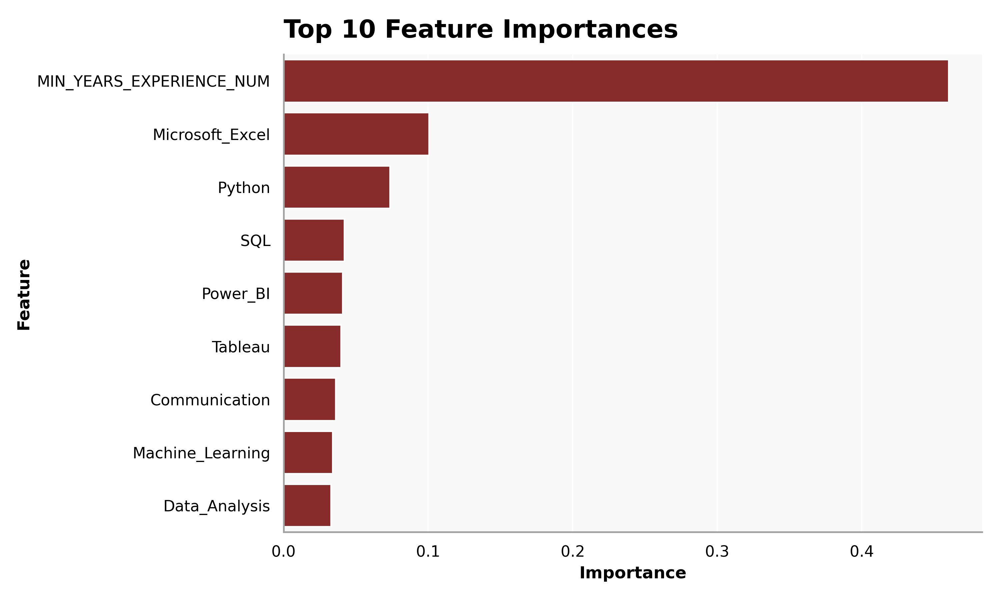
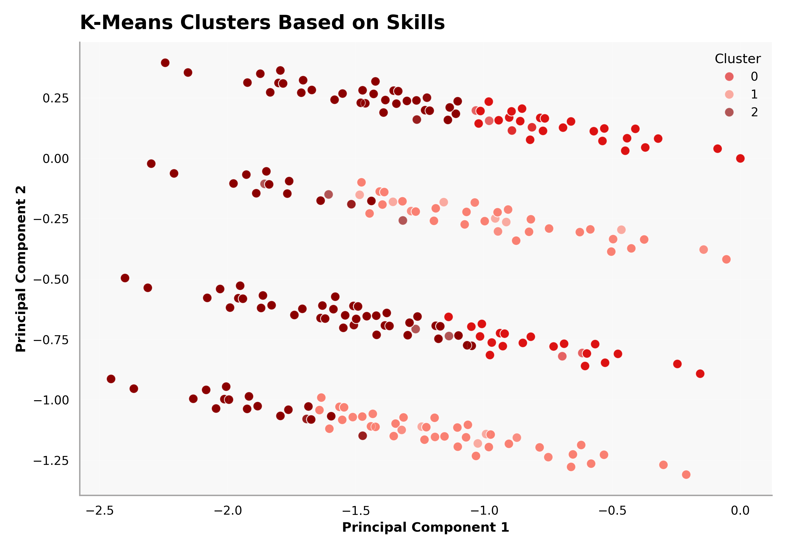
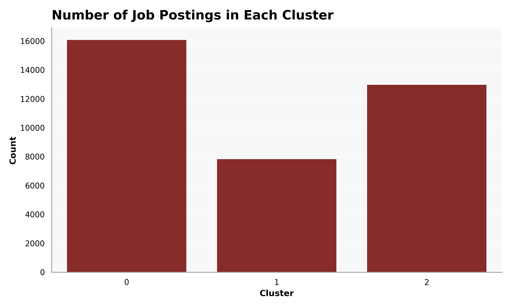

Using machine learning methods to predict job growth trends.
```{python}
#| echo: false
#| warning: false
#| message: false

import plotly_setup
import matplotlib_setup
```
```{python}
#| echo: true
#| eval: false
#| warning: false
#| message: false

import os
import pandas as pd
import numpy as np

from pyspark.sql import SparkSession

# Start a Spark session
spark = SparkSession.builder.config("spark.driver.host", "localhost").appName("JobPostingsAnalysis").getOrCreate()
spark.catalog.clearCache()

# Load the CSV file into a Spark DataFrame
df = spark.read.option("header", "true").option("inferSchema", "true").option(
    "multiLine", "true").option("escape", "\"").csv("./data/clean_job_postings.csv")

# Register the DataFrame as a temporary SQL view
df.createOrReplaceTempView("clean_job_postings")

# Show Schema and Sample Data
#print("---This is Diagnostic check, No need to print it in the final doc---")

# comment the lines below when rendering the submission
#df.printSchema()
#df.show(5)
```

# Filtering and Feature Selection

```{python}
#| echo: true
#| eval: false
#| warning: false
#| message: false
from pyspark.sql import functions as F

topic_keywords = [
    "data scientist",
    "data analyst",
    "business analyst",
    "business intelligence",
    "machine learning",
    "analytics"
]

condition = None
for kw in topic_keywords:
    current_condition = F.lower(F.col("SPECIALIZED_OCCUPATION")).contains(kw)
    condition = current_condition if condition is None else (condition | current_condition)

df_analysis = df.filter(F.col("SALARY").isNotNull()) \
    .filter(F.col("SPECIALIZED_OCCUPATION").isNotNull()) \
    .filter(condition)

df_analysis_show = df_analysis.select("SPECIALIZED_OCCUPATION", "SALARY")

df_analysis_pd = df_analysis_show.toPandas()
df_analysis_pd.to_csv("./data/filtered_job_postings.csv", index=False)
```

We started by narrowing the dataset to relevant roles like data analyst, business analyst, and machine learning positions, while removing rows with missing salary data. Looking at the sample output, most salaries cluster around the ~$110k–$115k range, with a few outliers like $170k . This tells us early on that the dataset is fairly compressed around a midpoint, which will make it harder for the model to explain variation. We also see a heavy concentration of “Data Analyst” roles, meaning we are working with a relatively homogeneous group rather than a wide range of job types.


```{python}
#| echo: false
#| eval: true

import pandas as pd
df_analysis_pd = pd.read_csv("./data/filtered_job_postings.csv")

df_analysis_pd.head(15).style.hide(axis="index")
```

# Feature Engineering

```{python}
#| echo: true
#| eval: false
#| warning: false
#| message: false
skill_features = [
    "Python",
    "SQL",
    "Microsoft Excel",
    "Data Analysis",
    "Machine Learning",
    "Power BI",
    "Tableau",
    "Communication"
]

df_analysis = df_analysis.withColumn(
    "ALL_SKILLS_TEXT",
    F.concat_ws(
        " ",
        F.coalesce(F.col("SOFTWARE_SKILLS_NAME"), F.lit("")),
        F.coalesce(F.col("SPECIALIZED_SKILLS_NAME"), F.lit("")),
        F.coalesce(F.col("COMMON_SKILLS_NAME"), F.lit(""))
    )
)

for skill in skill_features:
    safe_name = skill.replace(" ", "_") \
                     .replace("(", "") \
                     .replace(")", "") \
                     .replace("/", "_") \
                     .replace("-", "_")
    
    df_analysis = df_analysis.withColumn(
        safe_name,
        F.when(F.col("ALL_SKILLS_TEXT").contains(skill), 1).otherwise(0)
    )

feature_eng_show = df_analysis.select(
    "SALARY",
    "Python",
    "SQL",
    "Microsoft_Excel",
    "Data_Analysis",
    "Machine_Learning",
    "Power_BI",
    "Tableau",
    "Communication")

feature_eng_pd = feature_eng_show.toPandas()
feature_eng_pd.to_csv("./data/feature_engineered_job_postings.csv", index=False)
```

We then converted key skills like Python, SQL, Tableau, and Communication into binary features. From the output, Data Analysis appears in almost every row, while Python and SQL vary much more . This is important because it shows that Data Analysis is essentially a baseline requirement, while Python and SQL will act as stronger differentiators in the model. The fact that Communication is less common than technical skills also suggests it could be a key factor in explaining salary differences, as it may indicate more senior or cross-functional roles.

```{python}
#| echo: false
#| eval: true

import pandas as pd
df_analysis_pd = pd.read_csv("./data/feature_engineered_job_postings.csv")

df_analysis_pd.head(15).style.hide(axis="index")
```
```{python}
#| echo: true
#| eval: false
#| warning: false
#| message: false

df_analysis = df_analysis.withColumn(
    "MIN_YEARS_EXPERIENCE_NUM",
    F.when(
        F.col("MIN_YEARS_EXPERIENCE").rlike("^[0-9]+(\\.[0-9]+)?$"),
        F.col("MIN_YEARS_EXPERIENCE").cast("double")
    ).otherwise(0.0)
)

df_analysis = df_analysis.fillna({
    "REMOTE_TYPE_NAME": "Not Listed",
    "MIN_EDULEVELS_NAME": "Not Listed"
})

df_analysis.select(
    "MIN_YEARS_EXPERIENCE",
    "MIN_YEARS_EXPERIENCE_NUM",
    "REMOTE_TYPE_NAME",
    "MIN_EDULEVELS_NAME")
```

Years of experience columns were converted into a numeric field. This becomes critical later, as experience ends up being the single most influential variable in the model. Even in early outputs, we can see experience values embedded in the feature vectors, signaling its importance.

# Variable Selection
```{python}
#| echo: true
#| eval: false
#| warning: false
#| message: false
continuous_cols = [
    "MIN_YEARS_EXPERIENCE_NUM",
    "Python",
    "SQL",
    "Microsoft_Excel",
    "Data_Analysis",
    "Machine_Learning",
    "Power_BI",
    "Tableau",
    "Communication"
]

categorical_cols = [
    "REMOTE_TYPE_NAME",
    "SPECIALIZED_OCCUPATION"
]

target_col = "SALARY"

df_final = df_analysis.select(continuous_cols + categorical_cols + [target_col])

df_final = df_final.dropna(subset=continuous_cols + categorical_cols + [target_col])

df_final_pd = feature_eng_show.toPandas()
df_final_pd.to_csv("./data/variable_selection.csv", index=False)
```

We selected a combination of skill-based features, experience, and categorical variables. Most rows share baseline skills like Data Analysis, so the model is learning variation primarily from technical tools and experience rather than completely different job profiles. The presence of categorical variables like Remote Type and Specialized Occupation also allows the model to capture differences between, say, remote data analyst roles versus on-site machine learning positions, which may have distinct salary patterns.


```{python}
#| echo: false
#| eval: true

import pandas as pd
df_final_pd = pd.read_csv("./data/variable_selection.csv")

df_final_pd.head(15).style.hide(axis="index")
```

# String Indexing and One-Hot Encoding

```{python}
#| echo: true
#| eval: false
#| warning: false
#| message: false
from pyspark.ml.feature import StringIndexer, OneHotEncoder, VectorAssembler
from pyspark.ml import Pipeline

indexers = [
    StringIndexer(inputCol=col, outputCol=f"{col}_idx", handleInvalid="skip")
    for col in categorical_cols
]

encoders = [
    OneHotEncoder(inputCol=f"{col}_idx", outputCol=f"{col}_vec", dropLast=True)
    for col in categorical_cols
]

assembler = VectorAssembler(
    inputCols=continuous_cols + [f"{col}_vec" for col in categorical_cols],
    outputCol="features"
)

pipeline = Pipeline(stages=indexers + encoders + [assembler])
data = pipeline.fit(df_final).transform(df_final)

ml_ready = data.select("SALARY", "features")

ml_ready_pd = ml_ready .toPandas()
ml_ready_pd.to_csv("./data/string_indexed_job_postings.csv", index=False)
```

Categorical variables were encoded and then we assembled all features into a single vector. At this point, the data is fully machine learning ready. The feature vectors show that only a subset of skills are active per job, meaning the model is learning from relatively sparse combinations. The presence of one-hot encoded vectors for Remote Type and Specialized Occupation allows the model to differentiate between different job categories, which is crucial for explaining salary variation in a dataset that is otherwise fairly homogeneous in terms of baseline skills.

```{python}
#| echo: false
#| eval: true

import pandas as pd
ml_ready_pd = pd.read_csv("./data/string_indexed_job_postings.csv")

ml_ready_pd.head(15).style.hide(axis="index")
```

# Train-Test Split

```{python}
#| echo: true
#| eval: false
#| warning: false
#| message: false

train_df, test_df = ml_ready.randomSplit([0.8, 0.2], seed=42)

#print(f"Dimensions of full data: ({ml_ready.count()}, {len(ml_ready.columns)})")
#print(f"Dimensions of training data: ({train_df.count()}, {len(train_df.columns)})")
#print(f"Dimensions of test data: ({test_df.count()}, {len(test_df.columns)})")

split_summary = pd.DataFrame({
    "Dataset": ["Full", "Training", "Test"],
    "Rows": [ml_ready.count(), train_df.count(), test_df.count()],
    "Columns": [len(ml_ready.columns), len(train_df.columns), len(test_df.columns)]
})

split_summary.to_csv("./data/train_test_split_summary.csv", index=False)
```

We split the dataset into training and test sets using an 80/20 split, resulting in about 29k training rows and 7k test rows. This is a strong sample size, so any performance limitations we see are due to feature gaps, not lack of data. The training set is used to fit the models, while the test set provides an unbiased evaluation of how well the models generalize to new data. The fact that we have a large number of rows in both sets allows us to confidently assess model performance without worrying about overfitting or underfitting due to sample size constraints.

```{python}
#| echo: false
#| eval: true

import pandas as pd
split_summary = pd.read_csv("./data/train_test_split_summary.csv")

split_summary.head(15).style.hide(axis="index")
```

# Models

## Linear Regression Model

```{python}
#| echo: true
#| eval: false
#| warning: false
#| message: false
from pyspark.ml.regression import LinearRegression
from pyspark.ml.evaluation import RegressionEvaluator

lr = LinearRegression(
    featuresCol="features",
    labelCol="SALARY",
    predictionCol="prediction",
    solver="normal",
    regParam=0.0,
    elasticNetParam=0.0
)

lr_model = lr.fit(train_df)

predictions = lr_model.transform(test_df)

predictions_show = predictions.select("SALARY", "prediction")

predictions_show_pd = predictions_show.toPandas()
predictions_show_pd.to_csv("./data/predictions.csv", index=False)
```

The model predictions tend to cluster around ~$90k–$105k, even when actual salaries range widely. This shows the model is regressing toward the mean, struggling to capture both low and high salary extremes. The presence of many predictions around the $100k mark suggests the model is learning a general baseline salary for the types of jobs in the dataset, but it’s not effectively differentiating based on the features we provided. This indicates that while the model captures some underlying patterns, it’s missing key factors that drive salary variation, such as specific job titles, company size, or unmeasured skills.

```{python}
#| echo: false
#| eval: true

import pandas as pd
prediction_show_pd = pd.read_csv("./data/predictions.csv")

prediction_show_pd.head(15).style.hide(axis="index")
```

```{python}
#| echo: true
#| eval: false
#| warning: false
#| message: false
r2 = RegressionEvaluator(
    labelCol="SALARY",
    predictionCol="prediction",
    metricName="r2"
).evaluate(predictions)

rmse = RegressionEvaluator(
    labelCol="SALARY",
    predictionCol="prediction",
    metricName="rmse"
).evaluate(predictions)

mae = RegressionEvaluator(
    labelCol="SALARY",
    predictionCol="prediction",
    metricName="mae"
).evaluate(predictions)

#print("Intercept:", lr_model.intercept)
#print("Coefficients:", lr_model.coefficients)
#print("R-squared:", r2)
#print("RMSE:", rmse)
#print("MAE:", mae)

lr_results = pd.DataFrame({
    "Metric": ["Intercept", "Coefficients", "R-squared", "RMSE", "MAE"],
    "Value": [round(lr_model.intercept, 2),
        str([round(float(c), 2) for c in lr_model.coefficients]),
        round(r2, 4),
        round(rmse, 2),
        round(mae, 2)
]
})
lr_results.to_csv("./data/linear_regression_results.csv", index=False)
```


```{python}
#| echo: false
#| eval: true

import pandas as pd
lr_results = pd.read_csv("./data/linear_regression_results.csv")

lr_results.head(15).style.hide(axis="index")
```


With an R² of about 0.10 and an average error of ~$17k, the model explains only a small portion of salary variation. This confirms that important drivers like location, company, or industry are missing. The coefficients show that experience has the largest positive impact, while skills like Communication and Power BI have smaller effects. However, the overall low R² indicates that even the most influential features are not capturing enough of the underlying salary dynamics, suggesting that there are significant unmeasured factors at play.


```{python}
#| echo: true
#| eval: false
#| warning: false
#| message: false
num_features = lr_model.coefficients.size

feature_names = continuous_cols.copy()

remaining_features = num_features - len(feature_names)

for i in range(remaining_features):
    feature_names.append(f"encoded_category_{i}")

#print("Length of features:", len(feature_names))
#print("Length of coefs:", lr_model.coefficients.size)

coef_table = pd.DataFrame({
    "Feature": feature_names + ["Intercept"],
    "Estimate": [round(float(v), 4) for v in list(lr_model.coefficients.toArray()) + [lr_model.intercept]],
    "Std. Error": [round(float(v), 4) for v in summary.coefficientStandardErrors],
    "t value": [round(float(v), 4) for v in summary.tValues],
    "P-Value": [round(float(v), 4) for v in summary.pValues]
})
coef_table.to_csv("./data/lr_coefficients.csv", index=False)
```
```{python}
#| echo: false
#| eval: true

import pandas as pd
coef_table = pd.read_csv("./data/lr_coefficients.csv")

coef_table.head(15).style.hide(axis="index")
```
```{python}
#| echo: true
#| eval: false
#| warning: false
#| message: false
summary = lr_model.summary

coefficients = list(lr_model.coefficients.toArray())
standard_errors = list(summary.coefficientStandardErrors)
t_values = list(summary.tValues)
p_values = list(summary.pValues)

feature_names_with_intercept = feature_names + ["intercept"]
coefficients_with_intercept = coefficients + [lr_model.intercept]

#print("Length of features:", len(feature_names_with_intercept))
#print("Length of coefs:", len(coefficients_with_intercept))
#print("Length of se:", len(standard_errors))
#print("Length of tvals:", len(t_values))
#print("Length of p vals:", len(p_values))

lengths_df = pd.DataFrame({
    "Variable": ["Features", "Coefficients", "Std Errors", "t-values", "p-values"],
    "Length": [
        len(feature_names_with_intercept),
        len(coefficients_with_intercept),
        len(standard_errors),
        len(t_values),
        len(p_values)
    ]
})

lengths_df.to_csv("./data/lr_lengths.csv", index=False)
```

```{python}
#| echo: false
#| eval: true

import pandas as pd
lengths_df = pd.read_csv("./data/lr_lengths.csv")

lengths_df.head(15).style.hide(axis="index")
```
```{python}
#| echo: true
#| eval: false
#| warning: false
#| message: false

from IPython.display import display

summary = lr_model.summary

model_stats = pd.DataFrame({
    "Statistic": ["R-squared", "RMSE", "MAE", "Observations", "Residual DF"],
    "Value": [r2, rmse, mae, summary.numInstances, summary.degreesOfFreedom]
})

model_stats.to_csv("./data/lr_model_stats.csv", index=False)
```
```{python}
#| echo: false
#| eval: true

import pandas as pd
model_stats = pd.read_csv("./data/lr_model_stats.csv")

model_stats.head(15).style.hide(axis="index")
```

## Random Forest Regression Model

```{python}
#| echo: true
#| eval: false
#| warning: false
#| message: false
from pyspark.ml.regression import RandomForestRegressor

rf = RandomForestRegressor(
    featuresCol="features", 
    labelCol="SALARY", 
    predictionCol="prediction_rf",
    numTrees=200,
    maxDepth=8,
    seed=42
)

rf_model = rf.fit(train_df)

rf_predictions = rf_model.transform(test_df)

rf_predictions_show = rf_predictions.select("SALARY", "prediction_rf")

rf_predictions_show_pd = rf_predictions_show.toPandas()
rf_predictions_show_pd.to_csv("./data/rf_predictions.csv", index=False)
```
```{python}
#| echo: false
#| eval: true

import pandas as pd
rf_prediction_show_pd = pd.read_csv("./data/rf_predictions.csv")

rf_prediction_show_pd.head(15).style.hide(axis="index")
```
```{python}
#| echo: true
#| eval: false
#| warning: false
#| message: false
r2_rf = RegressionEvaluator(
    labelCol="SALARY",
    predictionCol="prediction_rf",
    metricName="r2"
).evaluate(rf_predictions)

rmse_rf = RegressionEvaluator(
    labelCol="SALARY",
    predictionCol="prediction_rf",
    metricName="rmse"
).evaluate(rf_predictions)

mae_rf = RegressionEvaluator(
    labelCol="SALARY",
    predictionCol="prediction_rf",
    metricName="mae"
).evaluate(rf_predictions)

#print("Random Forest Regression R-squared:", r2_rf)
#print("Random Forest Regression RMSE:", rmse_rf)
#print("Random Forest Regression MAE:", mae_rf)

rf_results = pd.DataFrame({
    "Metric": ["R-squared", "RMSE", "MAE"],
    "Value": [r2_rf, rmse_rf, mae_rf]
})
rf_results.to_csv("./data/random_forest_results.csv", index=False)
```

The random forest improves performance slightly, increasing R² to about 0.21. This suggests nonlinear relationships exist, but the model still lacks key variables to fully explain salary. The RMSE and MAE are also reduced, indicating better predictions, but the model still struggles with outliers and extreme values. The improvement over linear regression confirms that there are complex interactions between features, but the overall low R² indicates that significant unmeasured factors are still driving salary variation.


```{python}
#| echo: false
#| eval: true

import pandas as pd
rf_results_pd = pd.read_csv("./data/random_forest_results.csv")

rf_results_pd.head(15).style.hide(axis="index")
```

```{python}
#| echo: true
#| eval: false
#| warning: false
#| message: false
num_rf_features = rf_model.featureImportances.size

rf_feature_names = continuous_cols.copy()

remaining_rf_features = num_rf_features - len(rf_feature_names)

for i in range(remaining_rf_features):
    rf_feature_names.append(f"encoded_category_{i}")

#print("Length of feature names:", len(rf_feature_names))
#print("Length of importances:", rf_model.featureImportances.size)
```
```{python}
#| echo: true
#| eval: false
#| warning: false
#| message: false
import pandas as pd

rf_importances = list(rf_model.featureImportances.toArray())

rf_importance_df = pd.DataFrame({
    "Feature": rf_feature_names,
    "Importance": rf_importances
}).sort_values(by="Importance", ascending=False)

rf_importance_df.to_csv("./data/rf_feature_importance.csv", index=False)
```


```{python}
#| echo: false
#| eval: true

import pandas as pd
rf_importance_pd = pd.read_csv("./data/rf_feature_importance.csv")

rf_importance_pd.head(15).style.hide(axis="index")
```


```{python}
#| echo: true
#| eval: false
#| warning: false
#| message: false
import matplotlib.pyplot as plt
import seaborn as sns
top10_rf_clean = rf_importance_df[
    ~rf_importance_df["Feature"].str.contains("encoded_category")
].head(10)

top10_rf_clean = rf_importance_df[
    ~rf_importance_df["Feature"].str.contains("encoded_category")
].head(10)

plt.figure(figsize=(10, 6))
sns.barplot(
    data=top10_rf_clean,
    x="Importance",
    y="Feature"
)

plt.title("Top 10 Feature Importances", loc="left")
plt.xlabel("Importance")
plt.ylabel("Feature")
plt.tight_layout()
plt.savefig("images/rf_feature_importance_v2.png", dpi=300)
#plt.show()
```
{width=80% fig-align="center" #fig-rf-feature-importance fig-alt="Bar chart showing the top 10 feature importances from the random forest regression model. The most important features are Python, Data Analysis, and Machine Learning."}

@fig-rf-feature-importance: Bar chart showing the top 10 feature importances from the random forest regression model. Experience dominates the model with nearly half of total importance. Skills like Python and SQL matter, but much less. This clearly shows that experience is the primary driver of salary. The model is learning that more experienced candidates command higher salaries, which aligns with real-world expectations. The fact that technical skills have much lower importance suggests that while they contribute to salary, they are not as critical as overall experience in this dataset. Categorical variables have minimal importance, indicating that the model is not finding strong salary differences based on job type or remote status, which may be due to the homogeneity of the dataset or missing contextual factors.

## K-Means Clustering

```{python}
#| echo: true
#| eval: false
#| warning: false
#| message: false
cluster_features = [
    "Python",
    "SQL",
    "Microsoft_Excel",
    "Data_Analysis",
    "Machine_Learning",
    "Power_BI",
    "Tableau",
    "Communication"
]

df_cluster_ready = df_analysis.select(
    "ONET_NAME",
    "SPECIALIZED_OCCUPATION",
    *cluster_features
).dropna(subset=["ONET_NAME"])

df_cluster_ready
#print("Rows ready for clustering:", df_cluster_ready.count())

df_cluster_ready_pd = df_cluster_ready.toPandas()
df_cluster_ready_pd.to_csv("./data/cluster_ready_data.csv", index=False)
```
```{python}
#| echo: false
#| eval: true

import pandas as pd
df_cluster_ready_pd = pd.read_csv("./data/cluster_ready_data.csv")

df_cluster_ready_pd.head(15).style.hide(axis="index")
```
```{python}
#| echo: true
#| eval: false
#| warning: false
#| message: false
from pyspark.ml.feature import VectorAssembler

assembler = VectorAssembler(
    inputCols=cluster_features,
    outputCol="features"
)

cluster_data = assembler.transform(df_cluster_ready)

cluster_data_show = cluster_data.select("ONET_NAME", "SPECIALIZED_OCCUPATION", "features")

cluster_data_show_pd = cluster_data_show.toPandas()
cluster_data_show_pd.to_csv("./data/cluster_data.csv", index=False)
```

```{python}
#| echo: false
#| eval: true

import pandas as pd
cluster_data_show_pd = pd.read_csv("./data/cluster_data.csv")

cluster_data_show_pd.head(15).style.hide(axis="index")
```
```{python}
#| echo: true
#| eval: false
#| warning: false
#| message: false
from pyspark.ml.clustering import KMeans

kmeans = KMeans(
    featuresCol="features",
    predictionCol="cluster",
    k=3,
    seed=42
)

kmeans_model = kmeans.fit(cluster_data)

cluster_predictions = kmeans_model.transform(cluster_data)

cluster_predictions_show = cluster_predictions.select(
    "SPECIALIZED_OCCUPATION",
    "ONET_NAME",
    "cluster")

cluster_predictions_show_pd = cluster_predictions_show.toPandas()
cluster_predictions_show_pd.to_csv("./data/cluster_predictions.csv", index=False)

```

```{python}
#| echo: false
#| eval: true

import pandas as pd
cluster_predictions_show_pd = pd.read_csv("./data/cluster_predictions.csv")

cluster_predictions_show_pd.head(15).style.hide(axis="index")
```

We grouped jobs into three clusters based on skill profiles. Even within similar job titles, we see distinct groupings driven by different combinations of skills. For example, one cluster may contain roles that heavily require Python and Machine Learning, while another cluster may focus more on SQL and Data Analysis. This shows that there are meaningful subgroups within the dataset that share similar skill requirements, which could correspond to different career paths or specializations within the broader field of data-related jobs.

```{python}
#| echo: true
#| eval: false
#| warning: false
#| message: false
from pyspark.ml.evaluation import ClusteringEvaluator

evaluator = ClusteringEvaluator(
    featuresCol="features",
    predictionCol="cluster",
    metricName="silhouette"
)

silhouette = evaluator.evaluate(cluster_predictions)

#print("Silhouette Score:", silhouette)

silhouette_df = pd.DataFrame({
    "Metric": ["Silhouette Score"],
    "Value": [round(silhouette, 4)]
})
silhouette_df.to_csv("./data/kmeans_silhouette.csv", index=False)
```

```{python}
#| echo: false
#| eval: true

import pandas as pd
silhouette_df = pd.read_csv("./data/kmeans_silhouette.csv")

silhouette_df.head(15).style.hide(axis="index")
```

The silhouette score of ~0.33 indicates moderate clustering quality. This means the clusters are meaningful but not cleanly separated, which reflects real-world overlap in job roles. The fact that the score is above 0 suggests that the clusters are capturing some underlying structure in the data, but the relatively low value indicates that there is still significant overlap between clusters. This is expected given the nature of job postings, where many roles share similar skill requirements, leading to blurred boundaries between clusters.

```{python}
#| echo: true
#| eval: false
#| warning: false
#| message: false
cluster_onet = cluster_predictions.groupBy("cluster", "ONET_NAME") \
    .count() \
    .orderBy("cluster", F.col("count").desc())

#cluster_onet.show(30, truncate=False)

cluster_onet_pd = cluster_onet.toPandas()
cluster_onet_pd.to_csv("./data/cluster_onet_counts.csv", index=False)
```

```{python}
#| echo: false
#| eval: true

import pandas as pd
cluster_onet_pd = pd.read_csv("./data/cluster_onet_counts.csv")

cluster_onet_pd.head(15).style.hide(axis="index")
```
```{python}
#| echo: true
#| eval: false
#| warning: false
#| message: false
centers = kmeans_model.clusterCenters()

#for i, center in enumerate(centers):
    #print(f"Cluster {i} center:")
    #for feature_name, value in zip(cluster_features, center):
        #print(f"  {feature_name}: {round(float(value), 3)}")

rows = []
for i, center in enumerate(centers):
    row = {"Cluster": i}
    for feature_name, value in zip(cluster_features, center):
        row[feature_name] = round(float(value), 3)
    rows.append(row)

centers_df = pd.DataFrame(rows)
centers_df.to_csv("./data/kmeans_cluster_centers.csv", index=False)
```

```{python}
#| echo: false
#| eval: true

import pandas as pd
centers_df = pd.read_csv("./data/kmeans_cluster_centers.csv")

centers_df.head(15).style.hide(axis="index")
```

The clusters break into three clear groups: general analysts with low technical skills, business-focused roles with strong communication and Excel usage, and technical roles with high Python and SQL. This gives a strong segmentation of the job market. The first cluster likely represents entry-level or less technical roles, while the second cluster may correspond to business analyst positions that require strong communication and Excel skills. The third cluster is likely composed of more technical roles such as data scientists or machine learning engineers that require advanced programming skills. This segmentation provides valuable insights into the different types of roles within the dataset and how they group together based on required skills.

```{python}
#| echo: true
#| eval: false
#| warning: false
#| message: false
from pyspark.ml.feature import PCA

pca = PCA(k=2, inputCol="features", outputCol="pcaFeatures")
pca_model = pca.fit(cluster_predictions)
pca_result = pca_model.transform(cluster_predictions)

pca_pd = pca_result.select(
    "cluster",
    "SPECIALIZED_OCCUPATION",
    "ONET_NAME",
    "pcaFeatures"
).toPandas()

pca_pd["PC1"] = pca_pd["pcaFeatures"].apply(lambda v: float(v[0]))
pca_pd["PC2"] = pca_pd["pcaFeatures"].apply(lambda v: float(v[1]))

#pca_pd.head()

pca_pd.to_csv("./data/pca_results.csv", index=False)
```

```{python}
#| echo: false
#| eval: true

import pandas as pd
pca_pd = pd.read_csv("./data/pca_results.csv")

pca_pd.head(15).style.hide(axis="index")
```


```{python}
#| echo: true
#| eval: false
#| warning: false
#| message: false
plt.figure(figsize=(10, 7))

sns.scatterplot(
    data=pca_pd,
    x="PC1",
    y="PC2",
    hue="cluster",
    palette=["#DC1212", "#FA8072", "#8B0000"],
    s=70,
    alpha=0.65,
)

plt.title("K-Means Clusters Based on Skills",loc="left")
plt.xlabel("Principal Component 1")
plt.ylabel("Principal Component 2")
plt.legend(title="Cluster")
plt.grid(alpha=0.2)
plt.tight_layout()
plt.savefig("./images/kmeans_clusters.png", dpi=300)
#plt.show()
```
{width=80% fig-align="center" #fig-kmeans-clusters fig-alt="Scatter plot showing the K-means clusters of job postings based on their required skills. The x-axis is the first principal component and the y-axis is the second principal component. Points are colored by cluster."}

@fig-kmeans-clusters: Scatter plot showing the K-means clusters of job postings based on their required skills. The x-axis is the first principal component and the y-axis is the second principal component. Points are colored by cluster. The PCA plot reveals that while there are distinct groupings, there is also significant overlap between clusters, which is consistent with the moderate silhouette score. This suggests that many job postings share similar skill requirements, leading to blurred boundaries between clusters. The presence of hybrid roles that require a mix of technical and business skills likely contributes to this overlap, reflecting the real-world complexity of job markets where roles often do not fit neatly into isolated categories.

```{python}
#| echo: true
#| eval: false
#| warning: false
#| message: false
cluster_counts_pd = (
    cluster_predictions.groupBy("cluster")
    .count()
    .orderBy("cluster")
    .toPandas()
)

plt.figure(figsize=(10, 6))
sns.barplot(data=cluster_counts_pd, x="cluster", y="count")

plt.title("Number of Job Postings in Each Cluster", loc="left")
plt.xlabel("Cluster")
plt.ylabel("Count")
plt.tight_layout()
plt.savefig("./images/cluster_counts.png", dpi=300)
#plt.show()
```
{width=80% fig-align="center" #fig-cluster-counts fig-alt="Bar chart showing the number of job postings in each K-means cluster."}

@fig-cluster-counts: Bar chart showing the number of job postings in each K-means cluster are forming but overlapping, confirming that roles are hybrid rather than strictly separated. We see that Cluster 0 contains the largest number of job postings at around 16,000, followed by Cluster 2 with roughly 13,000, while Cluster 1 is significantly smaller at about 7,800. This tells us that most roles fall into the more general or technical skill groupings, while fewer roles are purely business-focused. The imbalance also reinforces that the job market is not evenly distributed across skill types. Instead, there is higher demand for broadly applicable or technically oriented roles, with a smaller share of positions emphasizing primarily business or communication-heavy skill sets. This aligns with our earlier clustering results, where the business-focused cluster appeared more niche compared to the generalist and technical clusters.
