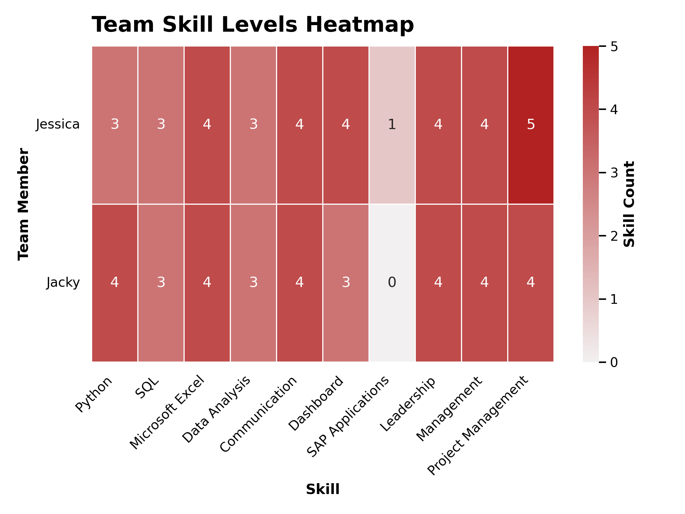

```{python}
#| echo: false
#| warning: false
#| message: false

import plotly_setup
import matplotlib_setup
```
# Data Loading 
```{python}
#| echo: true
#| eval: false
from pyspark.sql import SparkSession

# Start a Spark session
spark = SparkSession.builder.config("spark.driver.host", "localhost").appName("JobPostingsAnalysis").getOrCreate()
spark.catalog.clearCache()

# Load the CSV file into a Spark DataFrame
df = spark.read.option("header", "true").option("inferSchema", "true").option(
    "multiLine", "true").option("escape", "\"").csv("./data/clean_job_postings.csv")

# Register the DataFrame as a temporary SQL view
df.createOrReplaceTempView("clean_job_postings")

# Show Schema and Sample Data
#print("---This is Diagnostic check, No need to print it in the final doc---")

# comment the lines below when rendering the submission
#df.printSchema()
#df.show(5)
``` 
# Top Skills in Job Postings
```{python}
#| echo: true
#| eval: false
#| warning: false
#| message: false
from pyspark.sql import functions as F
import matplotlib.pyplot as plt

skill_columns = [
    "SOFTWARE_SKILLS_NAME",
    "SPECIALIZED_SKILLS_NAME",
    "COMMON_SKILLS_NAME"
]

skill_dfs = []

for col_name in skill_columns:
    temp_df = (
        df
        .select(
            F.lit(col_name).alias("skill_type"),
            F.explode(
                F.split(
                    F.regexp_replace(F.col(col_name), r'[\[\]"]', ''),
                    r',\s*'
                )
            ).alias("skill")
        )
        .withColumn("skill", F.trim(F.col("skill")))
        .filter(F.col("skill").isNotNull())
        .filter(F.col("skill") != "")
        .filter(F.col("skill") != "None")
    )

    skill_dfs.append(temp_df)

all_skills = skill_dfs[0]

for temp_df in skill_dfs[1:]:
    all_skills = all_skills.unionByName(temp_df)

skill_frequency = (
    all_skills
    .groupBy("skill")
    .count()
    .orderBy("count", ascending=False)
)
top_skills = skill_frequency.limit(20).toPandas()

top_skills.to_csv("./data/top_skills.csv", index=False)
```

```{python}
#| echo: true
#| eval: true
import pandas as pd
top_skills = pd.read_csv("./data/top_skills.csv")

top_skills.head(15).style.hide(axis="index")
```

# Team-Based Skill Level Baseline
## Table
```{python}
#| echo: true
#| eval: false
#| warning: false
#| message: false
import pandas as pd

skills_data = {
    "Name": ["Jessica", "Jacky"],
    "Python": [3, 4],
    "SQL": [3, 3],
    "Microsoft Excel": [4, 4],
    "Data Analysis": [3, 3],
    "Communication": [4, 4],
    "Dashboard": [4, 3],
    "SAP Applications": [1, 0],
    "Leadership": [4, 4],
    "Management": [4, 4],
    "Project Management": [5, 4]
}

df_skills = pd.DataFrame(skills_data)
df_skills = df_skills.set_index("Name")
df_skills.to_csv("./data/df_skills.csv") 
```

```{python}
#| echo: true
#| eval: true
import pandas as pd
df_skills = pd.read_csv("./data/df_skills.csv", index_col="Name")

df_skills.reset_index().head(15).style.hide(axis="index")
```
## Visualization
```{python}
#| echo: true
#| eval: false
#| warning: false
#| message: false
import seaborn as sns
import matplotlib.pyplot as plt

plt.figure(figsize=(8, 6))

sns.heatmap(
    df_skills,
    cmap=sns.light_palette("#B22222", as_cmap=True),
    linewidths=0.5,
    linecolor="white",
    annot=True,
    fmt=".0f",
    cbar_kws={"label": "Skill Count"}
)

plt.title("Team Skill Levels Heatmap", fontweight="bold", loc="left")
plt.xlabel("Skill", fontweight="bold")
plt.ylabel("Team Member", fontweight="bold")

plt.xticks(rotation=45, ha="right")
plt.yticks(rotation=0)

plt.tight_layout()
plt.savefig("./images/team_skill_levels_heatmap.png", dpi=300)
plt.show()
```



## Skill Gap Analysis Summary
We looked at our own skill set against what the market is asking for in data science and business analytics to see where we’re strong and where we need to improve. We have a solid foundation in Excel, communication, and project management, but there’s a clear opportunity to get closer to market demand by building more technical depth and getting better at connecting analysis to real business decisions.

The biggest gap for both of us is around Python, SQL, data analysis, and visualization tools. We’ve both used them, but we’re still at a mid-level, which makes this the highest impact area to focus on. Individually, Jessica is strong on the business and communication side and would benefit from building more technical depth. Jacky is stronger technically, but can improve in storytelling and turning analysis into clear insights.

To improve and practice, we plan to keep building both technical and business skills by using a mix of online courses and hands-on projects with datasets that we find interesting. We’ll continue using our GitHub sites to share those projects, track our progress, and build a portfolio. More importantly, it gives us a way to keep collaborating, combine our strengths, and keep improving together over time.